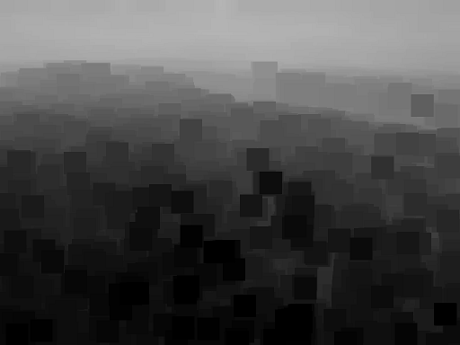

# Minimum and Maximum filters 

## Introduction

This is a minimum and maximum filter program written in C++ scratch. It mainly follows the routine
described in the paper [A fast algorithm for local minimum and maximum filters on rectangular and octagonal kernels](http://www.sciencedirect.com/science/article/pii/016786559290069C),
which is also the one used by [dark channel](http://kaiminghe.com/cvpr09/index.html).


[](https://travis-ci.org/ppwwyyxx/panorama)

##Compile Dependencies:
  
* gcc >= 4.7
* [OpenCV](www.opencv.org)


## Examples:



For more examples, see [results](https://github.com/herzhang/maxminfilter/master/image).

## Speed
Tested on Intel Core i5-3470, @3.2GHz:

|  Image Size \Patch Size| 15x15| 50x50|
| ------------- |:-------------:| :-----:| 
| 600x400     |  23ms |42ms|
| 1024x768    |  93ms |164ms|

Time consumption is known as O(1).

## Algorithms
 [A fast algorithm for local minimum and maximum filters on rectangular and octagonal kernels, Pattern Recognition Letters 13, 7, 517–521](http://www.sciencedirect.com/science/article/pii/016786559290069C)


##Author

```javascript
  var ihubo = {
    nickName  : "Wincoder",
    site : "http://herzhang.github.io"
  }
```